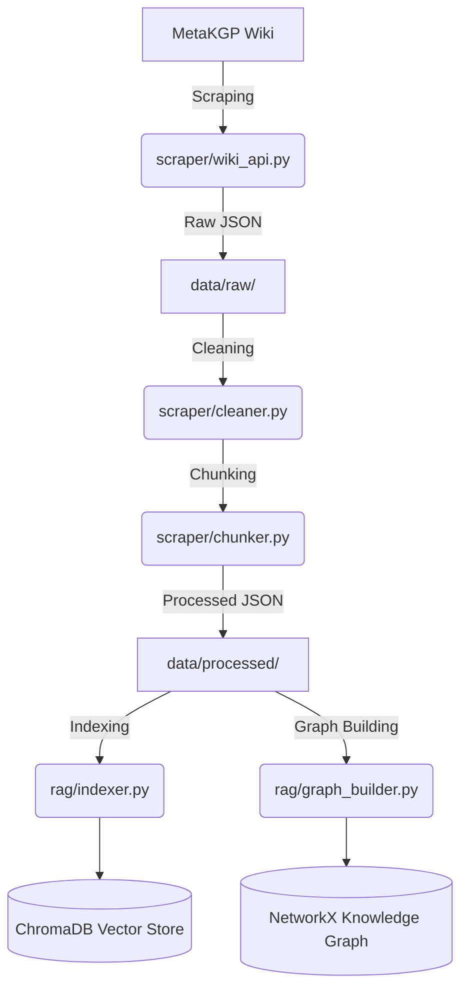
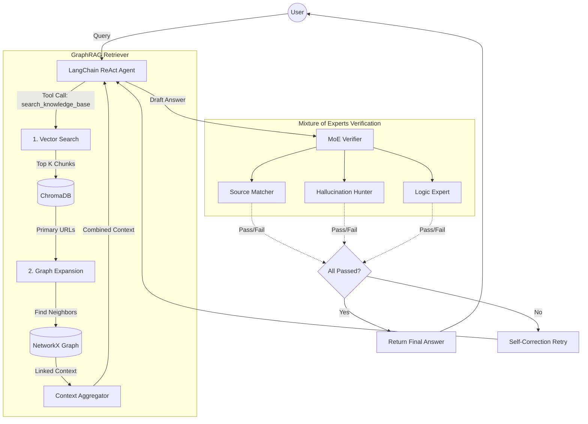

# MetaKGP GraphRAG Agent (GraphMind)

## Goal and Motivation
The primary goal of this project is to build a highly accurate, hallucination-free Conversational AI Agent capable of answering complex, multi-hop questions about the MetaKGP (IIT Kharagpur) wiki. 

Traditional RAG (Retrieval-Augmented Generation) systems often struggle with synthesizing information across multiple disconnected documents. To solve this, we employ a **GraphRAG architecture**—combining the semantic search capabilities of a Vector Database with the structured, relational data of a Knowledge Graph. Furthermore, to ensure the utmost accuracy and prevent hallucinations, the agent utilizes a **Chain of Thought (CoT)** reasoning process backed by a strict **Mixture of Experts (MoE) Verification** step.

## Tech Stack
* **Agent Framework:** LangChain & LangGraph (for building the ReAct agent and tool integration)
* **LLM:** Google Gemini 2.5 Flash (chosen for its speed, large context window, and reasoning capabilities)
* **Vector Database:** ChromaDB (for fast semantic similarity search)
* **Knowledge Graph:** NetworkX (for storing and traversing entity relationships and page links)
* **Embeddings:** `sentence-transformers/all-MiniLM-L6-v2` (for generating local chunk embeddings)
* **Language:** Python

## Data Pipeline
The data ingestion process is designed to be idempotent and modular. Raw data is never modified, and the pipeline can be safely re-run.

1. **Scraping**: `scraper/wiki_api.py` fetches raw JSON data from the MetaKGP MediaWiki API and stores it in `data/raw/`.
2. **Cleaning**: `scraper/cleaner.py` removes noise, HTML tags, and irrelevant formatting from the raw data.
3. **Chunking**: `scraper/chunker.py` splits the cleaned text into smaller, manageable chunks with a defined size and overlap.
4. **Ingestion**: `ingest.py` acts as the entry point, orchestrating the cleaning and chunking, saving the output to `data/processed/`.
5. **Indexing**: Processed chunks are embedded using local sentence transformers and stored in ChromaDB (`rag/indexer.py`), while relationships are extracted and stored in a NetworkX pickle file (`rag/graph_builder.py`).

## System Architecture: Knowledge Graph & Retriever
The system employs a two-phase retrieval process integrated tightly with a LangChain ReAct Agent.

### 1. GraphRAG Retriever (`rag/retriever.py`)
The retriever solves multi-hop queries by combining two search strategies:
* **Phase 1: Vector Search:** The user's query is embedded and searched against ChromaDB to find the most semantically similar text chunks. This returns the primary source URLs.
* **Phase 2: Graph Expansion:** Using the primary URLs, the retriever queries the NetworkX knowledge graph (`metakgp_graph.gpickle`) to find connected nodes (both incoming and outgoing links). This brings in supplementary context from related pages that might not share the exact keywords of the query but are relationally relevant.

### 2. The ReAct Agent & Verification (`rag/agent.py`)
* **Chain of Thought:** The agent thinks step-by-step. It determines if it needs more information and uses the `search_knowledge_base` tool (wrapping the GraphRAG Retriever) as many times as necessary to synthesize a complete answer.
* **Mixture of Experts (MoE) Verification:** Before returning an answer to the user, the draft answer is evaluated by a strict panel of three LLM "experts":
    1. **Source Matcher:** Verifies the text actually supports the claim.
    2. **Hallucination Hunter:** Ensures no external or fabricated details were added.
    3. **Logic Expert:** Checks that the conclusion logically follows the premises.
* If verification fails, the agent is given the specific feedback and triggers a self-correction retry loop to fix the answer.
